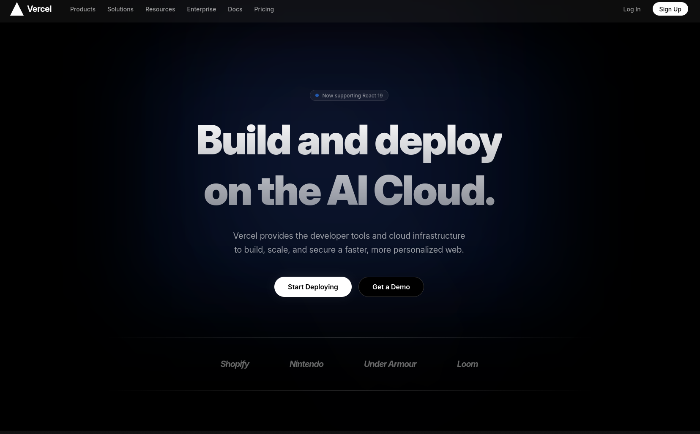
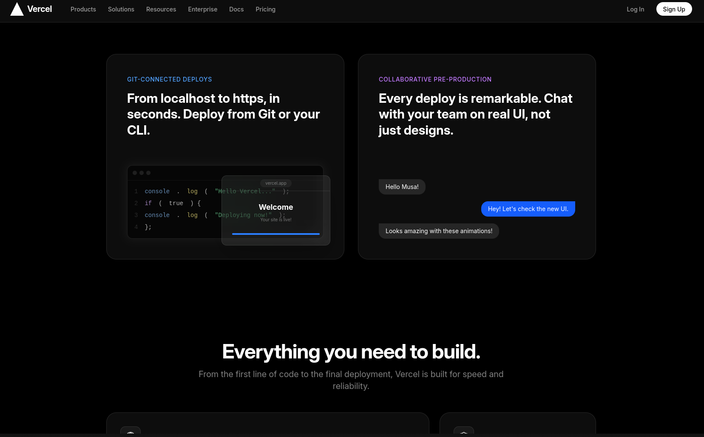
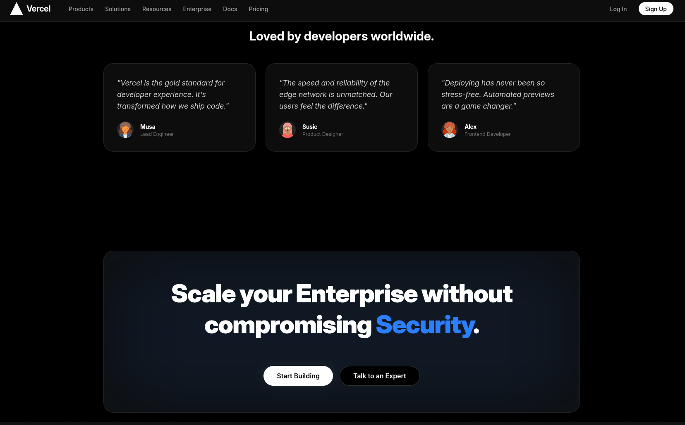

# Vercel Clone

A high-performance Vercel landing page clone built with React, Tailwind CSS, and Framer Motion.

## Visuals

## Features

- **Premium Design**: Dark-mode aesthetic with glassmorphism and animated gradients.
- **Dynamic Animations**: Scroll-reveal, floating elements, and parallax effects using Framer Motion.
- **Interactive UI**: Mouse-following spotlight and responsive layouts.
- **Modern Stack**: React 19, Tailwind CSS 4, and Lucide Icons.
